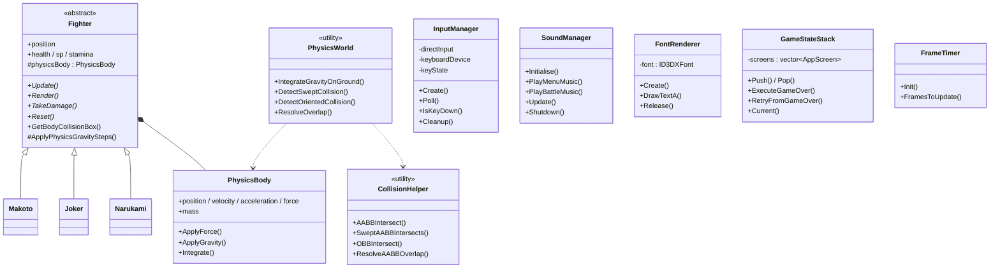

# Class Diagram (BMCS2224)

## Design Notes
- **OO Framework:** all playable characters inherit `Fighter`; battle code talks to the base pointer (`g_Player1` / `g_Player2`).
- **Reuse:** sprite RECT formulas, physics gravity, body push, and HUD meters are shared.
- **Should NOT do compliance:** sprite RECTs are computed from sheet `cols/rows/cellSize` (no hardcoded per-frame RECT tables).
