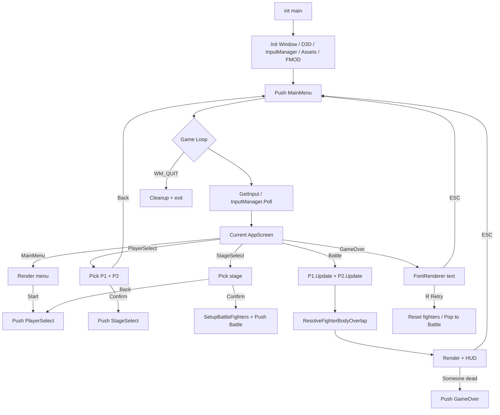

# Program Flow (BMCS2224)

## High-Level Screen Flow (GameStateStack)

## Battle Frame Flow
1. `InputManager::Poll` updates DirectInput key state  
2. Human fighter reads keys → state machine (walk / jump / attack / skill)  
3. `ApplyPhysicsGravitySteps` integrates force-based gravity when airborne  
4. Hitboxes / skill effects apply damage  
5. `ResolveFighterBodyOverlap` prevents walking through the opponent  
6. `Render` draws stage, fighters (formula sprite RECTs), HUD / fonts  

## Entry Point
`int main` in `main.cpp` (Windows subsystem entry `mainCRTStartup`) owns the game loop and state stack.
